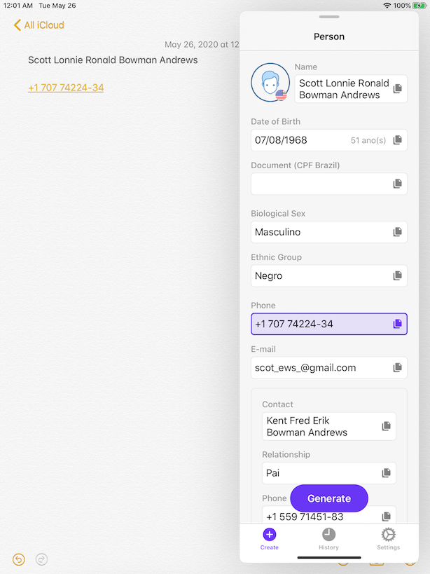
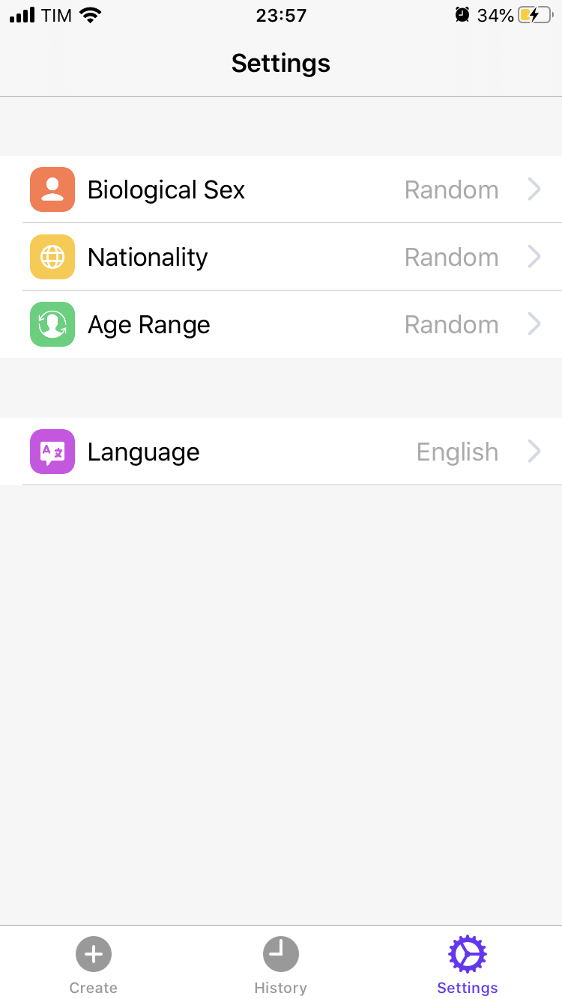

# GenPerson app for iOS, iPadOS and macOS

A people generator designed for developers to test their applications.
All data is generated at random and the use of it as well as this app is intended for testing of software under development.

**The generated profile contains the following information:**
- Name
- Date of Birth
- Biological Sex
- Ethnic Group
- Document (CPF only for Brazilian profiles)
- Phone
- E-mail
- Contact
    - Name
    - Relationship
    - Phone

**Languages:**
- Portguese (Brazil)
- English

## Copy and paste

One click on the field to copy.

## SplitView and Slide Over support

### History

### Settings

### External libraries

- [Realm](https://realm.io): data storage and caching

## Building the app

**Requirements:**
- iOS or iPadOS 13 or later
- macOS 10.15 or later
- Xcode 11 or later

Building the app requires Swift Package Manager.
